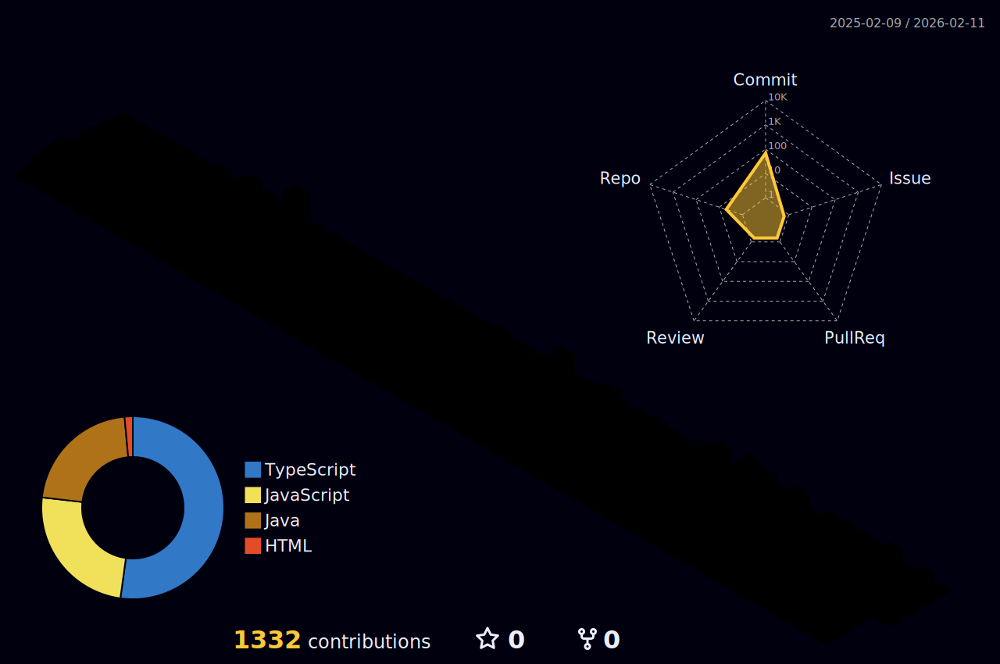

### Olá! Meu nome é Lucas Bento

- 💻 Atualmente trabalhando com Front-end
- 🥸 Estudando Nodejs, banco de dados(MySql e MongoDB), React Native, Kotlin, GO, Flutter 
- 📨 email para contato: lucasbentoskl@outlook.com
- 🆙 Nivel do inglês: A2

   
  

   
  
  ##
  
  
  
  
  
  
  
  
  
  
  
  ##
  

#### ⚡ GitHub Stats

<!--  -->
<!--  -->

